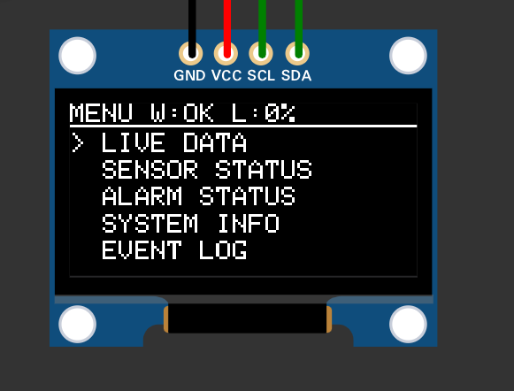
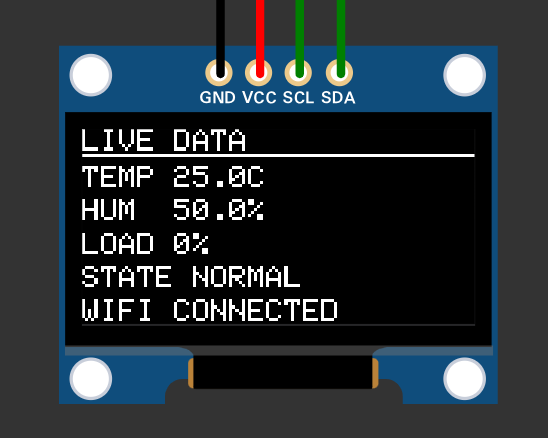
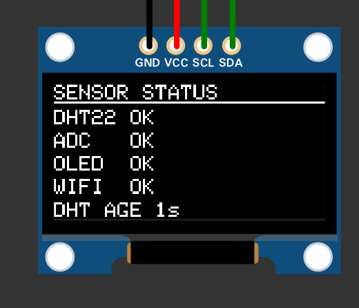
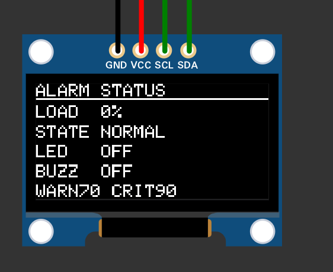
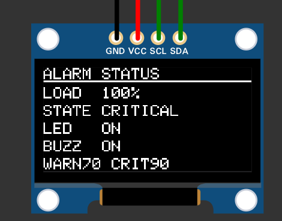
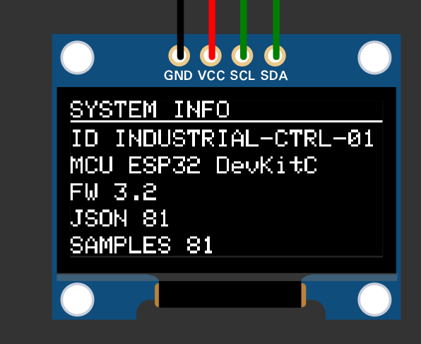
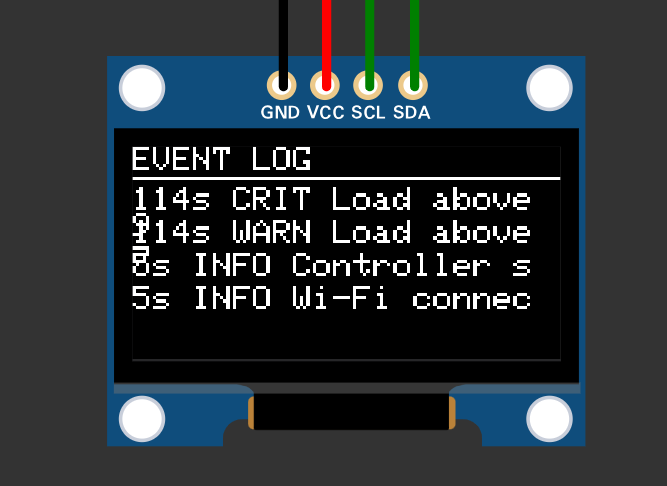
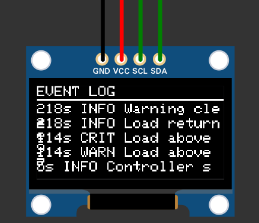

# Industrial IoT Monitoring Controller

An ESP32-based Industrial IoT monitoring controller designed for real-time sensor monitoring, machine-load detection, fault handling, alarm management, local OLED HMI, event logging, and Wi-Fi telemetry.

The project is developed and tested as a **Wokwi simulation** using an **ESP32 DevKitC V4**.

---

## Project Overview

The controller monitors environmental and machine-related parameters and provides local operator feedback through an OLED display and alarm outputs.

The system currently supports:

* 🌡️ Temperature monitoring using a DHT22
* 💧 Humidity monitoring using a DHT22
* ⚙️ Analog machine-load monitoring
* 📊 4-sample moving-average filtering
* 🔍 Sensor fault detection
* 🚨 Warning and critical alarm states
* 🔁 Alarm hysteresis
* 💡 Alarm LED output
* 🔊 Buzzer alarm output
* 🖥️ SSD1306 OLED local HMI
* 🎛️ Three-button navigation
* 📡 Wi-Fi monitoring
* 🔄 Automatic Wi-Fi reconnection
* 📦 JSON serial telemetry
* 📝 Event logging
* 📑 Event-log pagination
* 🔔 Automatic alarm transition detection
* 🖥️ Serial diagnostics

---

## System Architecture

The controller follows a simple monitoring and control pipeline:

```text
        ┌───────────────┐
        │    DHT22      │
        │ Temperature   │
        │   Humidity    │
        └───────┬───────┘
                │
                ▼
        ┌───────────────┐
        │    Sensor     │
        │  Validation   │
        └───────┬───────┘
                │
                │
        ┌───────▼───────┐
        │  Analog Load   │
        │     Input      │
        └───────┬───────┘
                │
                ▼
        ┌───────────────┐
        │  4-Sample     │
        │ Moving Average │
        └───────┬───────┘
                │
                ▼
        ┌───────────────┐
        │ Load % / Fault│
        │   Evaluation  │
        └───────┬───────┘
                │
                ▼
        ┌───────────────┐
        │ Alarm State   │
        │    Machine    │
        └───────┬───────┘
                │
       ┌────────┼─────────┐
       ▼        ▼         ▼
     OLED    LED/Buzzer  Event Log
       │
       ▼
  Local Operator
    Interface

                │
                ▼
        ┌───────────────┐
        │ JSON Serial   │
        │  Telemetry    │
        └───────────────┘
                │
                ▼
             Wi-Fi
        Status / Reconnect
```

---

## Alarm State Machine

The controller uses four alarm states:

```text
              Load ≥ 70%
        ┌────────────────────┐
        │                    ▼
     NORMAL ──────────────> WARNING
        ▲                       │
        │                       │ Load ≥ 90%
        │                       ▼
        │                    CRITICAL
        │                       │
        └───────────────────────┘
              Recovery
```

### States

| State          | Description                                     |
| -------------- | ----------------------------------------------- |
| `NORMAL`       | System operating within normal conditions       |
| `WARNING`      | Machine load has reached the warning threshold  |
| `CRITICAL`     | Machine load has reached the critical threshold |
| `SENSOR_FAULT` | DHT22 or ADC fault has been detected            |

### Alarm Thresholds

| Condition      | Threshold |
| -------------- | --------: |
| Enter WARNING  |     ≥ 70% |
| Leave WARNING  |     < 68% |
| Enter CRITICAL |     ≥ 90% |
| Leave CRITICAL |     < 88% |

The **SENSOR_FAULT** state has the highest priority. A detected DHT22 or ADC fault therefore takes precedence over the normal load-based alarm states.

The CRITICAL and SENSOR_FAULT conditions activate the alarm LED and buzzer.

---

## Alarm Hysteresis

Hysteresis is used to prevent rapid switching between alarm states when the measured load is close to a threshold.

For example:

```text
WARNING ON   → 70%
WARNING OFF  → 68%

CRITICAL ON  → 90%
CRITICAL OFF → 88%
```

This creates a small separation between alarm activation and recovery thresholds and helps prevent alarm chatter.

---

## Sensor Monitoring

### DHT22

The DHT22 provides:

* Temperature
* Relative humidity

The firmware validates readings by checking:

* `NaN` sensor values
* Temperature limits
* Humidity limits
* Consecutive failed readings

After **3 consecutive invalid readings**, the DHT22 is considered faulty.

A valid reading clears the fault condition.

### Analog Machine Load

The machine-load input is read using the ESP32 ADC.

The ADC is configured for **12-bit resolution**:

```text
0 ─────────────── 4095
│                   │
0%                100%
```

The filtered ADC value is converted into a machine-load percentage from 0–100%.

---

## ADC Filtering

The machine-load signal uses a **4-sample moving-average filter**.

```text
Raw ADC Samples
      │
      ├── Sample 1
      ├── Sample 2
      ├── Sample 3
      └── Sample 4
             │
             ▼
      Moving Average
             │
             ▼
       Filtered ADC
             │
             ▼
        Load 0–100%
```

This reduces short-term fluctuations in the analog input before the value is used by the alarm state machine.

---

## OLED User Interface

The local HMI uses a **128 × 64 SSD1306 OLED** connected through I²C.

The interface contains:

1. Main Menu
2. Live Data
3. Sensor Status
4. Alarm Status
5. System Information
6. Event Log

Navigation is provided using three push buttons:

* **UP**
* **DOWN**
* **SELECT**

## OLED Screens

### Main Menu



### Live Data



### Sensor Status



### Alarm Status



### Alarm Status — Alarm Activated



### System Information



### Event Log



### Event Log — Additional View



## Alarm Demonstration

The project also includes a captured alarm condition showing the system operating with the alarm activated.

A normal system overview is also included:

---

## Hardware

The project targets an:

**ESP32 DevKitC V4**

### Pinout

| GPIO | Device       | Function     |
| ---: | ------------ | ------------ |
|   15 | DHT22        | Data         |
|   21 | SSD1306 OLED | SDA          |
|   22 | SSD1306 OLED | SCL          |
|   25 | Push Button  | UP           |
|   26 | Push Button  | DOWN         |
|   27 | Push Button  | SELECT       |
|   34 | Analog Input | Machine Load |
|    4 | LED          | Alarm        |
|    5 | Buzzer       | Alarm        |

### OLED Configuration

| Parameter  | Value    |
| ---------- | -------- |
| Controller | SSD1306  |
| Resolution | 128 × 64 |
| Interface  | I²C      |
| Address    | `0x3C`   |

### ADC Configuration

| Parameter    |                   Value |
| ------------ | ----------------------: |
| Resolution   |                  12-bit |
| Raw range    |                  0–4095 |
| Output range |                  0–100% |
| Filter       | 4-sample moving average |

---

## Firmware Timing

The firmware uses periodic non-blocking tasks based on `millis()`.

| Function          | Interval |
| ----------------- | -------: |
| ADC / load update |   100 ms |
| OLED update       |   150 ms |
| DHT22 update      |  2000 ms |
| Wi-Fi reconnect   | 10000 ms |
| Button debounce   |    40 ms |

This allows sensor monitoring, alarm processing, display updates, button handling, and Wi-Fi status monitoring to operate without putting the entire application into long blocking delays during normal operation.

---

## Wi-Fi Monitoring

The ESP32 uses Wi-Fi in station mode and connects to:

```text
Wokwi-GUEST
```

The firmware monitors the connection continuously.

If Wi-Fi becomes unavailable:

```text
Wi-Fi Connected
      │
      ▼
Connection Lost
      │
      ▼
Event Logged
      │
      ▼
Reconnect Attempt
      │
      ▼
Wi-Fi Reconnected
```

The controller records connection, disconnection, and reconnection events.

---

## JSON Telemetry

Sensor and system information is transmitted through the serial interface as structured telemetry.

A typical telemetry packet contains information such as:

```json
{
  "temperature": 25.0,
  "humidity": 50.0,
  "load": 45,
  "alarm": "NORMAL",
  "wifi": "CONNECTED"
}
```

The telemetry design provides a foundation for future integration with:

* MQTT
* IoT dashboards
* Cloud platforms
* Databases
* Remote monitoring systems

---

## Event Logging

The controller maintains an event log with a maximum of **10 events**.

Events include:

* Controller startup
* Wi-Fi connection
* Wi-Fi disconnection
* Wi-Fi reconnection
* DHT22 sensor faults
* DHT22 fault recovery
* ADC faults
* ADC fault recovery
* Alarm state transitions

The OLED Event Log screen displays recorded events and supports pagination.

---

## Fault Handling

Sensor faults are treated as a high-priority system condition.

### DHT22 Fault

```text
Invalid DHT22 reading
        │
        ▼
Failure counter
        │
        ▼
3 consecutive failures
        │
        ▼
DHT22 FAULT
        │
        ▼
SENSOR_FAULT state
```

### ADC Fault

The ADC input is checked against the expected 12-bit range.

If an invalid value is detected, the ADC fault condition is recorded and the alarm state machine can enter `SENSOR_FAULT`.

---

## Serial Diagnostics

The firmware also provides serial diagnostics for development and troubleshooting.

The serial interface operates at:

```text
115200 baud
```

Diagnostic output includes sensor status, temperature, humidity, ADC/load information, Wi-Fi events, and system status.

---

## Simulation

The project was developed and tested using **Wokwi**.

The simulation demonstrates:

* ESP32 operation
* DHT22 sensing
* Analog load input
* OLED display
* Button navigation
* Alarm LED
* Buzzer
* Alarm state transitions
* Sensor fault handling
* Event logging
* Wi-Fi monitoring
* Serial telemetry

---

## Repository Contents

The repository currently contains the following main project files:

```text
industrial-iot-monitoring-controller/
│
├── .gitignore
├── COMMIT_CHECKLIST.md
├── LICENSE
├── README.md
│
├── industrial_iot_controller.ino.ino
│
├── architecture.md
├── alarm-state-machine.md
├── pinout.md
├── serial-telemetry.json
│
├── main menu.png
├── live data.png
├── sensor status.png
├── alarm status.png
├── alarm status with alarm activated.png
├── system info.png
├── event log.png
├── event log2.png
├── final outline of the project.png
└── final outline of the project with alarm going off.png
```

---

## Documentation

Additional technical documentation is available in the repository:

* [System Architecture](architecture.md)
* [Alarm State Machine](alarm-state-machine.md)
* [Hardware Pinout](pinout.md)
* [Serial Telemetry](serial-telemetry.json)
* [Commit Checklist](COMMIT_CHECKLIST.md)

---

## Technologies

### Hardware

* ESP32 DevKitC V4
* DHT22
* SSD1306 OLED
* Push buttons
* Analog input
* LED
* Buzzer

### Software

* C/C++
* Arduino framework
* Wokwi
* Git
* GitHub

### Libraries

* `Wire`
* `Adafruit_GFX`
* `Adafruit_SSD1306`
* `DHT`
* `WiFi`

---

## Design Goals

The project was designed to demonstrate practical embedded and Industrial IoT engineering concepts rather than simply displaying sensor values.

Key design goals include:

* Reliable sensor validation
* Analog signal filtering
* Deterministic alarm-state handling
* Alarm hysteresis
* Fault-aware operation
* Local operator interface
* Event traceability
* Wi-Fi connection monitoring
* Structured telemetry
* Modular firmware organization

---

## Future Improvements

Possible future extensions include:

* MQTT telemetry
* Remote IoT dashboard
* Historical sensor graphs
* Persistent event storage
* RTC-based timestamps
* SD-card data logging
* Additional industrial sensors
* Current and voltage monitoring
* Remote alarm acknowledgement
* Web-based HMI
* OTA firmware updates
* Integration with physical industrial equipment

---

## License

This project is licensed under the **MIT License**.

See [LICENSE](LICENSE) for details.

---

## Author

**George Anil Kappen**

Industrial IoT • Embedded Systems • ESP32 • Sensor Monitoring • Automation

